# 🏦 NovaTrust Bank - Online Banking Web Application

## 📌 Overview

NovaTrust Bank is a full-stack banking web application developed using Java Servlets, JSP, JDBC, and MySQL. The project simulates the core functionalities of a modern online banking system, allowing users to manage accounts, transfer funds, track transactions, apply for loans and insurance plans, receive notifications, and access banking services through a secure web interface.

The application follows a layered architecture consisting of JSP views, Servlet controllers, Service Layer, DAO Layer, and MySQL database integration, ensuring clean code organization and maintainability.

---

## 🚀 Features

### 🔐 Authentication & Session Management

* User Registration
* User Login
* Secure Logout
* Session-Based Authentication
* Protected Page Access
* Input Validation

### 👤 User & Account Management

* User Profile Management
* View Account Details
* Account Creation
* Account Status Tracking

### 💸 Fund Transfer System

* Account-to-Account Money Transfer
* Transaction Processing
* Transfer Validation
* Transaction Status Tracking
* Transaction History Generation

### 📜 Transaction Management

* View Transaction History
* Transaction Record Maintenance
* Transfer Tracking
* Date-Based Transaction Records

### 🔔 Notification System

* Transfer Notifications
* Loan Notifications
* Insurance Notifications
* Banking Service Notifications
* Notification Tracking

### 🎁 Offers & Banking Services

* View Available Offers
* Promotional Banking Services
* Service Information Management

### 💼 Loan Management

* Browse Loan Options
* Apply for Loans
* Loan Status Tracking
* Interest Rate Management
* EMI Calculation
* Automated EMI Scheduling

### 🛡 Insurance Management

* View Insurance Plans
* Apply for Insurance
* Insurance Status Tracking
* User Insurance Records

### ⭐ Feedback Management

* Customer Feedback Submission
* Rating Support
* Service Reviews

---

## 🏗 System Architecture

The application follows a layered architecture:

```text
Presentation Layer (JSP)
          │
          ▼
Controller Layer (Servlets)
          │
          ▼
Service Layer
          │
          ▼
DAO Layer
          │
          ▼
MySQL Database
```

### Architecture Benefits

* Separation of Concerns
* Reusable Business Logic
* Easy Maintenance
* Scalable Design
* Better Code Organization

---

## 📂 Project Structure

```text
NovaTrustBank/
│
├── src/main/java
│
├── controller/
│   ├── AccountServlet.java
│   ├── DashboardServlet.java
│   ├── InsuranceServlet.java
│   ├── LoanServlet.java
│   ├── NotificationServlet.java
│   ├── OfferServlet.java
│   ├── TransactionServlet.java
│   └── UserServlet.java
│
├── dao/
│   ├── AccountDAO.java
│   ├── FeedbackDAO.java
│   ├── InsurancePlanDAO.java
│   ├── LoanDAO.java
│   ├── NotificationDAO.java
│   ├── OfferDAO.java
│   ├── ServiceDAO.java
│   ├── TransactionDAO.java
│   ├── UserDAO.java
│   └── UserInsuranceDAO.java
│
├── model/
│   ├── User.java
│   ├── Account.java
│   ├── Transaction.java
│   ├── Loan.java
│   ├── Offer.java
│   ├── Notification.java
│   ├── InsurancePlan.java
│   ├── UserInsurance.java
│   ├── Feedback.java
│   └── Service.java
│
├── services/
│   ├── UserService.java
│   ├── AccountService.java
│   ├── TransactionService.java
│   ├── LoanService.java
│   ├── InsuranceService.java
│   ├── NotificationService.java
│   └── OfferService.java
│
├── util/
│   ├── DBConnection.java
│   └── EMIScheduler.java
│
└── webapp/
    ├── JSP Pages
    ├── CSS
    └── WEB-INF
```

---

## 🗄 Database Design

The application uses a relational MySQL database with normalized tables for managing users, accounts, transactions, banking services, loans, insurance policies, and notifications.

### Database Tables

| Table Name      | Description                      |
| --------------- | -------------------------------- |
| users           | Stores user information          |
| accounts        | Stores account details           |
| transactions    | Stores transfer records          |
| notifications   | Stores user notifications        |
| offers          | Stores promotional offers        |
| loans           | Stores loan applications         |
| insurance_plans | Stores available insurance plans |
| user_insurance  | Stores user insurance records    |
| feedback        | Stores user feedback and ratings |
| services        | Stores banking services          |

---

## 🔄 Application Workflow

### User Registration Workflow

```text
User Registration
        ↓
User Record Creation
        ↓
Account Creation
        ↓
Login
        ↓
Dashboard Access
```

### Fund Transfer Workflow

```text
User Login
      ↓
Dashboard
      ↓
Transfer Request
      ↓
Transaction Processing
      ↓
Notification Generation
      ↓
Transaction History Update
```

### Loan Workflow

```text
View Loan Options
        ↓
Apply for Loan
        ↓
Loan Processing
        ↓
EMI Calculation
        ↓
Status Tracking
```

### Insurance Workflow

```text
View Insurance Plans
         ↓
Select Plan
         ↓
Submit Application
         ↓
Policy Creation
         ↓
Status Tracking
```

---

## ⏰ EMI Scheduler

NovaTrust Bank includes an automated EMI scheduling component implemented through the `EMIScheduler` utility. This module supports loan repayment scheduling and helps manage recurring EMI-related operations within the banking system.

---

## 🖥 User Interface Pages

### Authentication

* landing.jsp
* login.jsp
* register.jsp

### Dashboard

* dashboard.jsp

### Account Management

* account.jsp
* accountDetails.jsp
* createAccount.jsp

### Transactions

* transfer.jsp
* transactionHistory.jsp

### Loans

* loanOptions.jsp
* myLoans.jsp
* loanSuccess.jsp

### Profile

* profile.jsp

---

## 🛠 Technology Stack

### Frontend

* HTML5
* CSS3
* JSP

### Backend

* Java
* Java Servlets

### Database

* MySQL
* JDBC

### Server

* Apache Tomcat

### IDE

* Eclipse IDE

### Libraries

* MySQL Connector/J

---

## 🔒 Security Features

* Session-Based Authentication
* Protected URL Access
* Login Validation
* Input Validation
* Data Integrity Checks
* Controlled User Access
* Secure Database Connectivity

---

## 📸 Application Screenshots

### Landing Page

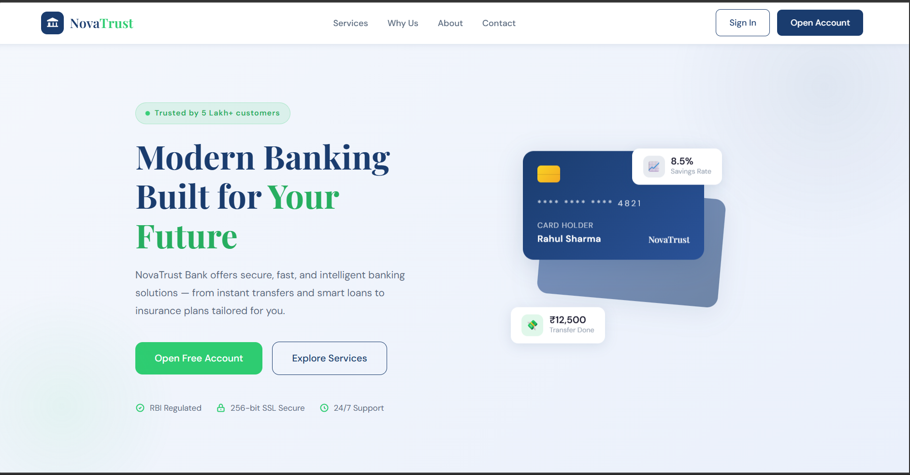

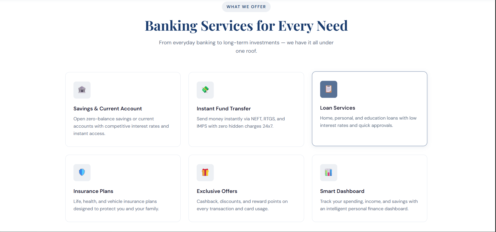

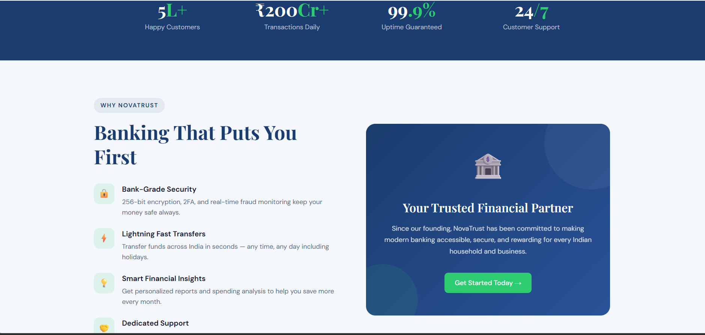

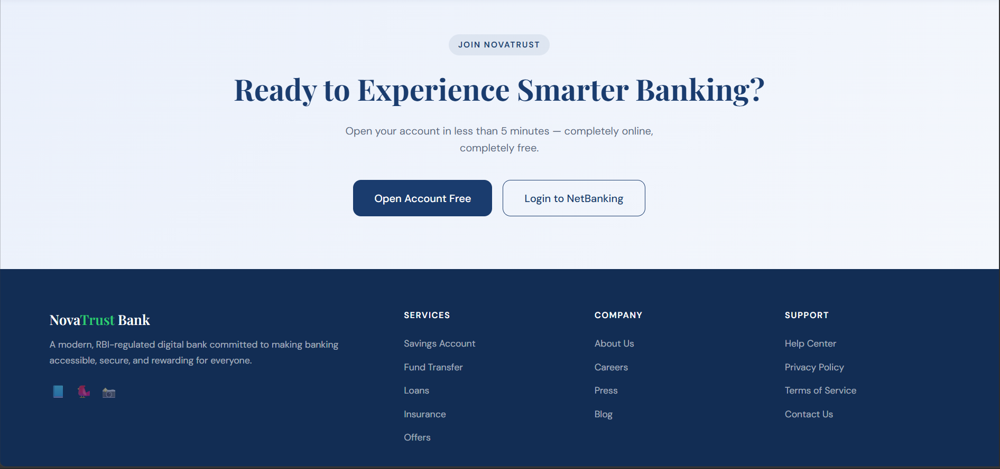

### Login Page

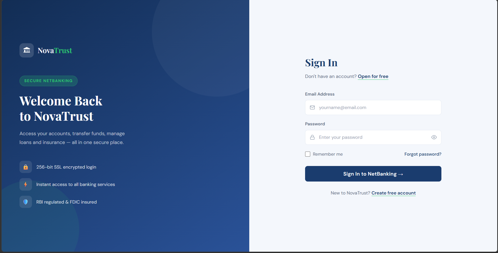

### Register Page

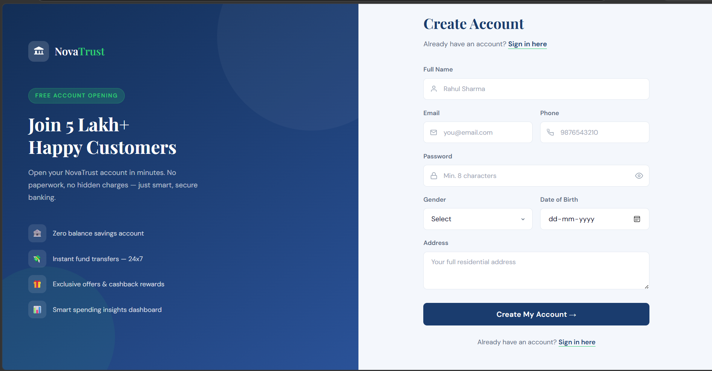


### Dashboard

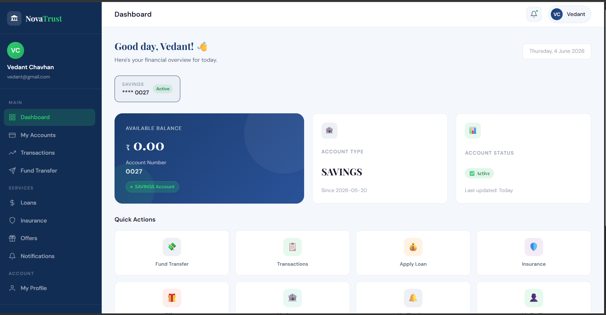

### Account Details

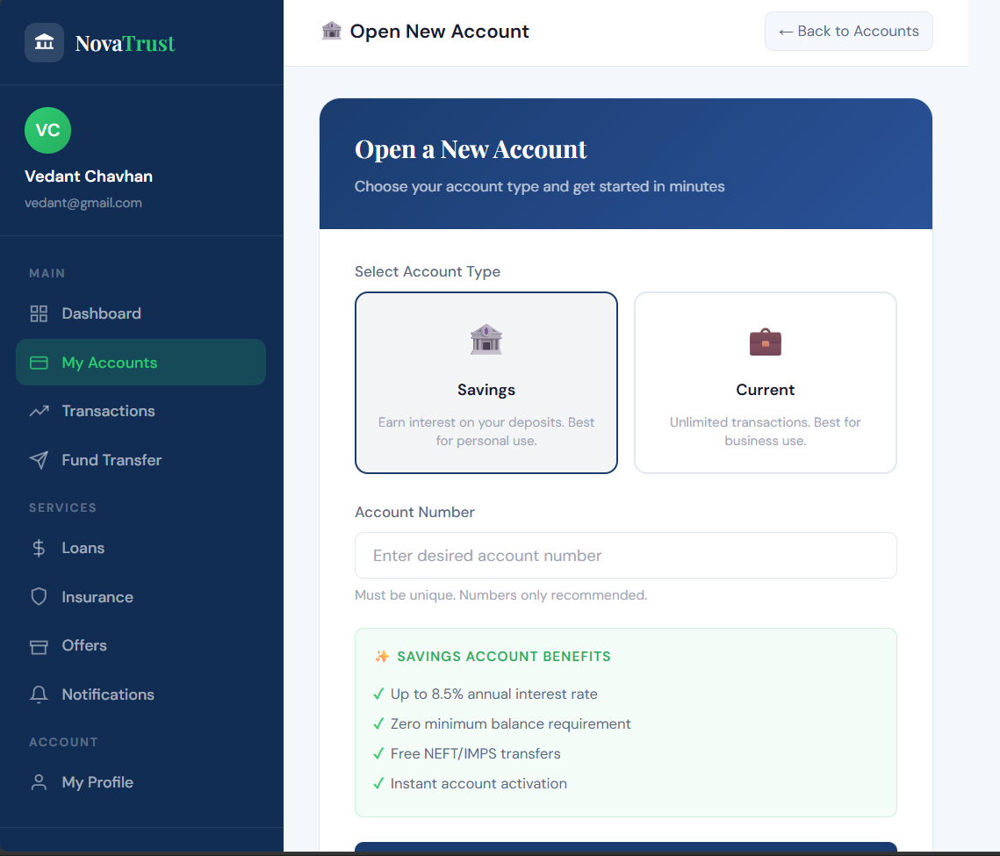

### Fund Transfer

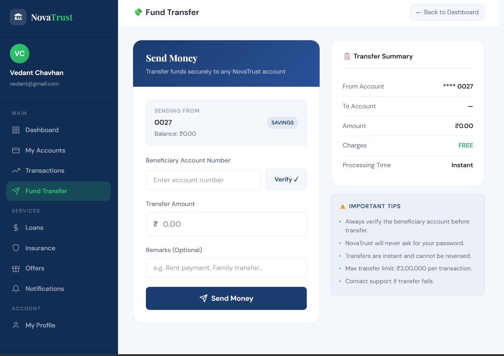

### Transaction History

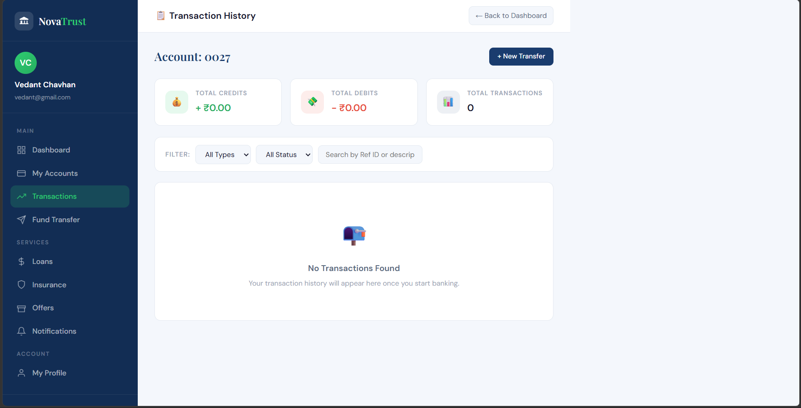

### Loan Services


### My Loans


### User Profile

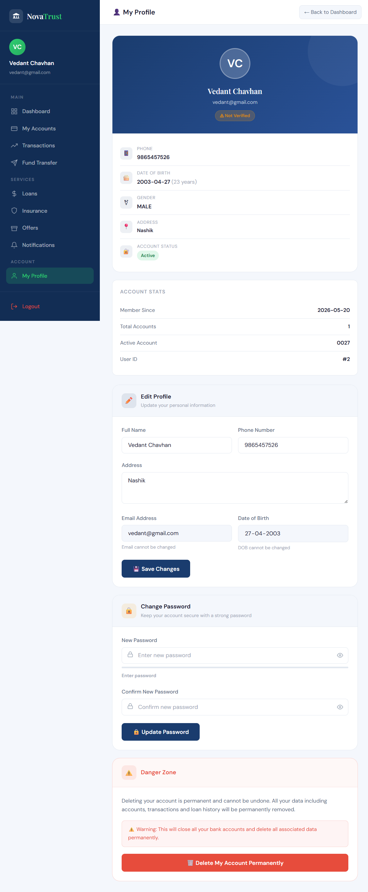

---

## 🗂 ER Diagram

Add your database ER diagram image in the screenshots folder and update the path below.


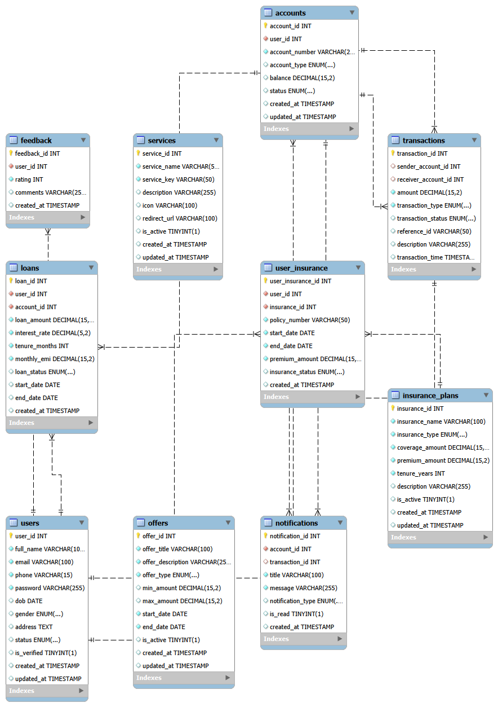


---

## ⚙ Installation & Setup

### Prerequisites

* JDK 8 or Above
* Eclipse IDE
* Apache Tomcat
* MySQL Server

### Steps

1. Clone the repository

```bash
git clone https://github.com/your-username/NovaTrustBank.git
```

2. Import the project into Eclipse.

3. Configure Apache Tomcat Server.

4. Create the MySQL database.

5. Import the database schema.

6. Update database credentials inside:

```text
src/main/java/util/DBConnection.java
```

7. Add MySQL Connector dependency.

8. Run the project on Tomcat Server.

9. Open the application in your browser.

---

## 🎯 Learning Outcomes

Through this project, the following concepts were explored and implemented:

* Java Web Development
* JSP & Servlets
* JDBC Integration
* DAO Pattern
* Service Layer Architecture
* MVC Design Principles
* Session Management
* Banking Workflow Design
* Relational Database Design
* Object-Oriented Programming
* Software Layering & Maintainability

---

## 🔮 Future Enhancements

* Email-Based OTP Verification
* SMS OTP Integration
* Admin Dashboard
* UPI Integration
* Mobile Banking Application
* PDF Statement Generation
* Role-Based Access Control
* REST API Integration
* Two-Factor Authentication
* Cloud Deployment

---

## 👨‍💻 Author

**Developer:** Niketan Sarode

NovaTrust Bank was developed as a full-stack banking application project to simulate real-world banking operations using Java Enterprise technologies and modern software design practices.

---

## 📄 License

This project is developed for educational and learning purposes.
